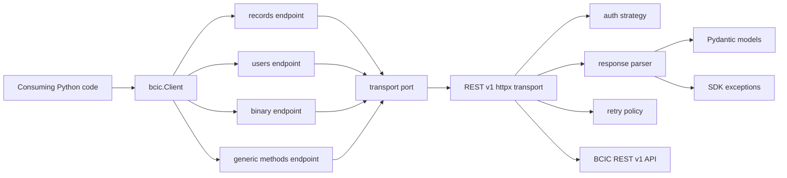

# Architecture Spine — bcic-client-api

## Design Paradigm

Use a hexagonal SDK architecture. The public `Client` and endpoint modules form the application-facing API. Authentication, REST v1 transport, response parsing, retry behavior, and logging are adapters behind internal boundaries. Pydantic models and SDK exceptions are shared contracts that can cross endpoint boundaries.



## Invariants & Rules

### AD-1 — Public API is domain-first [ADOPTED]

- **Binds:** PRD FR-1, FR-3, FR-13, FR-14, FR-15, FR-16, FR-17
- **Prevents:** Downstream callers and endpoint modules independently choosing raw REST method names as the default user experience.
- **Rule:** Supported operations are exposed through `Client` endpoint properties such as `client.records`, `client.users`, `client.binary`, and `client.methods`. `client.methods` is a documented lower-level escape hatch, not the main path.

### AD-2 — Endpoint modules do not construct HTTP requests

- **Binds:** PRD FR-3, FR-7, FR-10, FR-23
- **Prevents:** Each endpoint duplicating URL construction, retry setup, output format handling, and error mapping.
- **Rule:** Endpoint modules call the transport boundary with a REST v1 method name plus typed parameters or request models. Only the transport layer builds method-style REST v1 requests.

### AD-3 — Authentication is a strategy owned outside endpoints

- **Binds:** PRD FR-4, FR-5, FR-6
- **Prevents:** Session IDs, credentials, or token attachment logic spreading into endpoint methods.
- **Rule:** `auth.py` owns authentication strategies and session state. The transport asks the configured strategy to authenticate and attach credentials. Endpoint methods never accept or concatenate `sessionId`.

### AD-4 — SDK exceptions are the public failure boundary

- **Binds:** PRD FR-11, FR-12, FR-22
- **Prevents:** Callers needing to catch `httpx` errors, parser errors, or BCIC raw error envelopes.
- **Rule:** Any external failure crossing the public API must be mapped to the SDK exception hierarchy with sanitized context before it leaves the SDK.

### AD-5 — Models own validation and response shape

- **Binds:** PRD FR-18, FR-20, FR-21
- **Prevents:** Dynamic BCIC payloads causing unbounded `dict[str, Any]` use across the codebase.
- **Rule:** Public methods return Pydantic models, typed page objects, or typed mappings. Dynamic record fields use a deliberate typed mapping model; unrestricted `Any` stays at parser boundaries only.

### AD-6 — Pagination is centralized

- **Binds:** PRD FR-18, FR-19
- **Prevents:** Every endpoint implementing incompatible page traversal behavior.
- **Rule:** Page state and `list_all()` traversal live in `pagination.py` and shared helpers. Endpoint modules expose paging options but do not own traversal loops.

### AD-7 — Poetry owns project packaging and dependency state [ADOPTED]

- **Binds:** PRD FR-2, §6.1, §9
- **Prevents:** Tooling drift between package metadata, dependency declarations, test/lint/type-check config, and CI.
- **Rule:** `pyproject.toml` is the source of truth for package metadata, Poetry dependency groups, Ruff, mypy, and pytest configuration where practical. `poetry.lock` is committed for reproducible development and CI.

### AD-8 — Tests use injectable transport seams

- **Binds:** PRD FR-10, FR-12, FR-23
- **Prevents:** Unit tests requiring live BCIC credentials or a live tenant.
- **Rule:** Transport creation must support injection of an `httpx` client, transport, or equivalent test seam. Unit tests mock HTTP behavior and assert SDK behavior at auth, transport, pagination, model, and endpoint boundaries.

### AD-9 — REST v2 is isolated future scope [ADOPTED]

- **Binds:** PRD §1, §5, §6.2
- **Prevents:** REST v2 assumptions leaking into REST v1 MVP modules and destabilizing the first release.
- **Rule:** REST v2 implementation is deferred. Any future REST v2 support must enter through separate transport/endpoint adapters while preserving the `Client` public contract.

### AD-10 — JSON-first, XML-compatible parser boundary

- **Binds:** PRD FR-8, FR-9
- **Prevents:** XML support either blocking MVP or becoming impossible without public API breaks.
- **Rule:** MVP parser behavior is JSON-first. Output format remains a transport/parser concern so XML support can be added behind the same endpoint method names if required.

## Consistency Conventions

| Concern | Convention |
| --- | --- |
| Public module names | `bcic.Client` at top level; implementation modules remain under `bcic.*`. |
| Endpoint modules | One cohesive domain per file or package under `bcic/endpoints/`; each endpoint receives shared dependencies through composition. |
| REST v1 method names | REST method strings stay in endpoint constants or method metadata, not scattered inline across call sites. |
| Errors | Public errors inherit from one SDK base exception; raw `httpx` exceptions are wrapped. |
| Logging | Use `logging.getLogger(__name__)`; redact credentials, session IDs, tokens, and binary payloads. |
| Dynamic records | Use typed record containers with stable fields for object name, record ID, and field mapping. |
| Configuration | Configuration is validated before first request where possible and can be built from explicit values or environment variables. |
| Tests | Mock transport by default; no live BCIC calls in unit tests. |

## Stack

| Name | Version / Constraint |
| --- | --- |
| Python | 3.12+ |
| Poetry | Project dependency manager and build workflow; exact version controlled by developer/CI environment |
| httpx | Compatible version declared in `pyproject.toml`; exact resolved version in `poetry.lock` |
| Pydantic | v2-compatible constraint declared in `pyproject.toml` |
| tenacity | Compatible version declared in `pyproject.toml` |
| python-dotenv | Optional/local configuration helper |
| pytest | Development dependency |
| Ruff | Development dependency |
| mypy | Development dependency |

## Structural Seed

```text
bcic-client-api/
  pyproject.toml
  poetry.lock
  bcic/
    __init__.py
    client.py
    config.py
    auth.py
    transport.py
    pagination.py
    exceptions.py
    models/
      __init__.py
      common.py
      records.py
      users.py
      binary.py
    endpoints/
      __init__.py
      base.py
      records.py
      users.py
      binary.py
      methods.py
    utils/
      __init__.py
      logging.py
  tests/
    unit/
      test_client.py
      test_auth.py
      test_transport.py
      test_pagination.py
      test_exceptions.py
      test_endpoints_records.py
  docs/
    index.md
    installation.md
    quick-start.md
    authentication.md
    errors.md
    pagination.md
    api-reference.md
  examples/
    basic_usage.py
```

## Capability → Architecture Map

| Capability / Area | Lives in | Governed by |
| --- | --- | --- |
| Public import and Client | `bcic/__init__.py`, `bcic/client.py` | AD-1 |
| Client configuration | `bcic/config.py` | AD-7, conventions |
| Authentication/session lifecycle | `bcic/auth.py`, `bcic/transport.py` | AD-3 |
| REST v1 request execution | `bcic/transport.py` | AD-2, AD-10 |
| Retry policy | `bcic/transport.py` | AD-2 |
| Error mapping | `bcic/exceptions.py`, `bcic/transport.py` | AD-4 |
| Records endpoint | `bcic/endpoints/records.py`, `bcic/models/records.py` | AD-1, AD-2, AD-5, AD-6 |
| Users/roles/permissions reads | `bcic/endpoints/users.py`, `bcic/models/users.py` | AD-1, AD-2, AD-5 |
| Binary data | `bcic/endpoints/binary.py`, `bcic/models/binary.py` | AD-1, AD-2, AD-4 |
| Generic REST v1 methods | `bcic/endpoints/methods.py` | AD-1, AD-2 |
| Pagination | `bcic/pagination.py` | AD-6 |
| Tests | `tests/unit/` | AD-8 |
| Packaging/tooling | `pyproject.toml`, `poetry.lock` | AD-7 |

## Deferred

- Exact REST v1 method inventory for MVP: defer to epics/stories after reviewing each official REST v1 method page.
- XML parsing implementation: defer unless JSON is unavailable for required MVP methods.
- REST v2 adapter architecture: defer until REST v1 SDK foundation is stable.
- Live integration tests: defer until a BCIC sandbox, credentials, and data safety policy are defined.
- Organization-specific first-class domain modules such as plans or contacts: defer until tenant object naming and priority workflows are confirmed.
- Poetry installation and lockfile generation: defer to implementation environment setup because Poetry is not installed in the current workspace.
