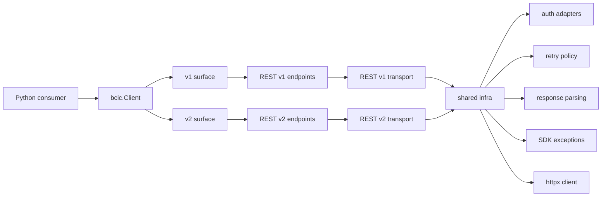

# Architecture Spine - bcic-client-api REST v2

## Design Paradigm

Use a versioned hexagonal SDK architecture.

The public API should keep one stable package entry point, but versioned client surfaces must remain explicit and isolated:

- v1 surface: current REST v1 behavior
- v2 surface: dedicated REST v2 endpoint set and transport rules
- shared infrastructure: configuration, retry policy, logging, base exceptions, HTTP client ownership



## Invariants & Rules

### AD-1 - Version selection is explicit

- **Rule:** API version selection must be declared through `api_version` or an equivalent explicit client/transport selector.
- **Prevents:** Implicit detection based on tenant behavior or response shape.
- **Why:** Consumers need predictable, testable behavior and migration control.

### AD-2 - v1 and v2 do not share business endpoint implementations

- **Rule:** v1 and v2 endpoint objects must live in separate modules/packages and own separate request construction logic.
- **Prevents:** Conditional branching across every endpoint method.
- **Why:** Different contracts should not be fused into one fragile abstraction.

### AD-3 - Shared infrastructure remains shared

- **Rule:** configuration, HTTP session ownership, retry policy, redaction, and base exceptions should be reusable from both versions.
- **Prevents:** Duplicated operational behavior.
- **Why:** These concerns are stable and cross-cutting.

### AD-4 - Auth is version-adapter specific

- **Rule:** authentication strategies are pluggable; v1 and v2 may use different auth flows, headers, or tokens.
- **Prevents:** v1 assumptions leaking into v2 auth.
- **Why:** auth often changes between API generations.

### AD-5 - Models are versioned contracts

- **Rule:** v1 and v2 response/request models must not be forced into one shared schema unless the contracts are proven identical.
- **Prevents:** accidental loss of fidelity.
- **Why:** model drift is one of the biggest sources of SDK breakage.

### AD-6 - Pagination is only shared when semantics match

- **Rule:** common pagination helpers can be shared only if cursor/page semantics are equivalent.
- **Prevents:** broken `list_all()` behavior across one version.
- **Why:** pagination is contract-specific even when it looks similar.

### AD-7 - Client exposes versioned entry points clearly

- **Rule:** the public `Client` should either expose `client.v1` and `client.v2`, or dispatch by explicit `api_version` at construction time, with no implicit switching.
- **Prevents:** user confusion over which contract is active.
- **Why:** the surface must make version choice obvious.

### AD-8 - Logging and errors remain unified

- **Rule:** both versions must use the same redaction policy and exception hierarchy where possible.
- **Prevents:** operational inconsistency between versions.
- **Why:** observability should be consistent even when contracts differ.

## Recommended Target Shape

### Public API

Preferred options, in order:

1. `Client(api_version="v1" | "v2")`
2. `client.v1` / `client.v2` sub-clients for advanced explicitness

The exact choice can be refined, but the version boundary must be visible in the public API.

### Internal Modules

Recommended package split:

```text
bcic/
  client.py
  config.py
  exceptions.py
  transport/
    __init__.py
    base.py
    v1.py
    v2.py
  auth/
    __init__.py
    base.py
    v1.py
    v2.py
  endpoints/
    v1/
    v2/
  models/
    common.py
    v1/
    v2/
  pagination/
    base.py
    v1.py
    v2.py
```

If the repository should remain flatter for now, the same conceptual split can still be preserved with versioned classes and modules.

## Capability Map

| Concern | Shared | v1-specific | v2-specific |
| --- | --- | --- | --- |
| Client construction | yes | no | no |
| Configuration validation | yes | no | no |
| HTTP client lifecycle | yes | no | no |
| Retry policy | yes | no | no |
| Error hierarchy | yes | no | no |
| Auth strategy selection | partial | yes | yes |
| Endpoint request building | no | yes | yes |
| Response parsing | partial | yes | yes |
| Request/response models | partial | yes | yes |
| Pagination helpers | partial | yes | yes |
| Docs and examples | yes | yes | yes |

## Deferred Decisions

- Whether v2 should be exposed as a separate import path, a sub-client, or a versioned factory.
- Whether any v1 domain helpers can be reused by composition-only wrappers.
- Which v2 endpoints are first-class in the initial release.
- Whether v2 pagination is page-based, cursor-based, or mixed.

